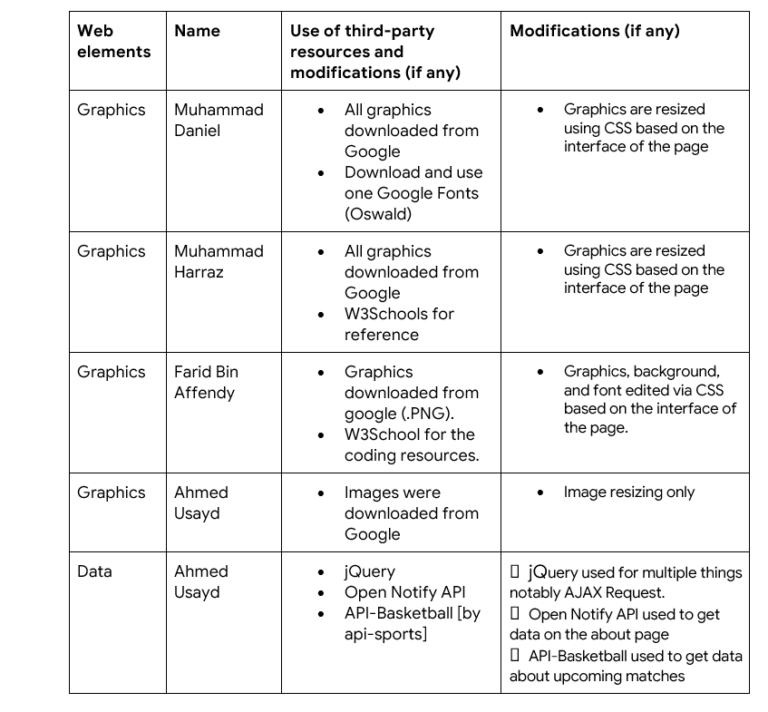

# Group Sports
Prepared by  
- Ahmed Usayd Md Yousuf Ali 1926573
- Farid Bin Affendy 1924303 
- Muhammad Daniel Bin Darmawi 1913823 
- Muhammad Fatih bin Abdul Razak 1919131
- Muhammad Harraz Bin Abd Rahim 1922475
---
‘Sports’ is a website providing descriptions for three sports 

# Project Description
Our group has planned to design and develop web pages using front-end web technologies regarding a certain topic about sports.  Our goal is to create a professional-looking website regarding our topic and letting the visitors of our website have a clear experience; no confusion and no drawbacks. Also, we try to make our website look as organized as possible so that it would not be confusing for us, especially the website visitors because they are our main priority. Besides, our content will be kept within the structure/format of the web page neatly.  

On the main webpage, we will be having subpages containing multiple varieties of sports, and these include Home Page, Football, Basketball, F1, and Gallery. The purpose of these webpages is so that each sport is fully explained and clarified to the visitors. This is so that they have a clear image of how the sport is ruled and how it is supposed to be played by the player or players in the team. Our information will be ranging from what the sport is, what the rules are, and what the main objectives are in that sport.

On the other hand, we tend to keep the format and the style of our webpage outstanding yet straightforward, to have a unique style, and make it look like it is in its top form quality. To achieve this, we use as many techniques as we can so that we have various styles including web media, color schemes, layouts, links, forms, and other features. 

Overall, we wish for the user and visitors of the website to have the best, smooth, and error-free experience. We also hope that the user is interested and does not feel bored somehow by our website; making them feel entertained by the informative webpages that we have produced creatively. 

# Project Sitemap

# Group Contributions

Each of the team members prepared 4 web pages for the project as shown in the following table.

# Use of third-party resources

# References

W3Schools
https://www.w3schools.com/html/default.asp

The JQuery Foundation. From
https://code.jquery.com

Basketball API
https://api-basketball.com

Open-Notify API 
http://open-notify.org/

Google Images
https://www.google.com/imghp

------------------------------------END OF README SAMPLE ----------------------------------------

